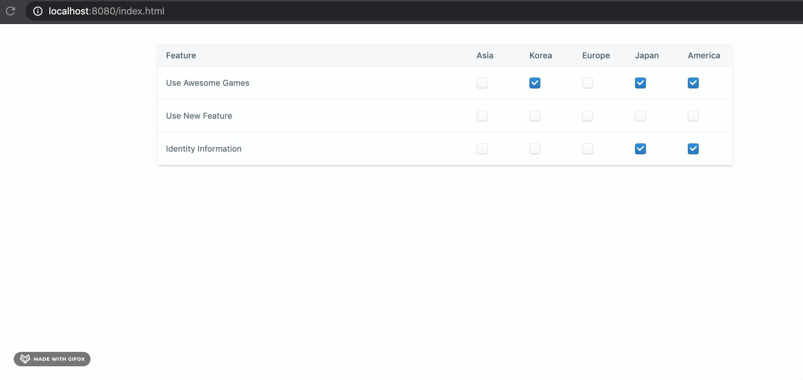

# ffs

This is a spring boot application with a front end built in React and the Evergreen CSS framework.
The application pulls data from the ffs service and allows the user to update features across the five regions provided.
The system's array data store of regions can expanded to allow for more regions. 

Here is a quick demonstration of the front end

To run the application, run the ```FfsApplication.java``` main method

The front end application is compiled into this repository. To see the code, plese refer to the [repo](https://github.com/deriggi/ffsfront)

